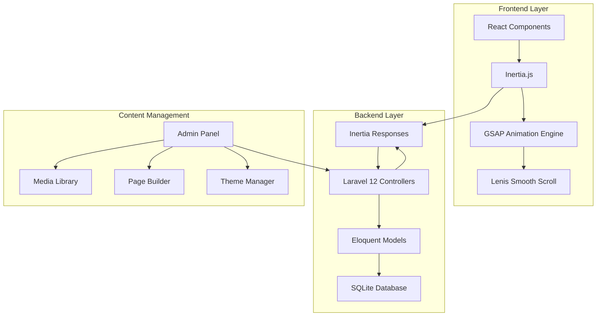

# Design Document: Avant-Garde CMS

## Overview

This design document outlines the architecture for converting static HTML/Tailwind designs into a production-ready Laravel 12 (Inertia/React) CMS application. The system combines a modern agency website frontend with a comprehensive content management system, featuring GSAP animations, smooth scrolling, and dynamic content management capabilities.

The application follows a hybrid SPA architecture using Inertia.js to bridge Laravel backend with React frontend, providing server-side routing and validation while delivering a smooth single-page application experience.

## Architecture

### System Architecture



### Technology Stack

- **Backend**: Laravel 12 with Inertia.js server adapter
- **Frontend**: React 18 with TypeScript support
- **Database**: SQLite for development, MySQL/PostgreSQL for production
- **Styling**: Tailwind CSS with custom design system
- **Animations**: GSAP with ScrollTrigger and Lenis smooth scroll
- **Build Tools**: Vite for asset compilation and hot reloading

### Request Flow

1. User requests a page through browser navigation
2. Laravel router matches the route and calls appropriate controller
3. Controller fetches data from Eloquent models
4. Inertia.render() returns JSON response with page component and props
5. React receives props and renders the component with animations
6. GSAP and Lenis initialize for smooth interactions

## Components and Interfaces

### Frontend Component Architecture

#### Layout Components
- **MainLayout**: Primary layout wrapper with navigation and footer
- **AdminLayout**: CMS admin interface layout with sidebar navigation
- **AuthLayout**: Authentication pages layout (login, register)

#### Shared Components
- **Navigation**: Main site navigation with full-screen menu overlay
- **Footer**: Site footer with contact information and links
- **AnimatedSection**: Wrapper for GSAP-animated content sections
- **MediaGallery**: Reusable image/video gallery component
- **ContactForm**: Contact form with validation and submission

#### Page-Specific Components
- **HeroSection**: Animated hero section with parallax effects
- **StatsSection**: Animated statistics display
- **ProjectCard**: Portfolio project preview card
- **ServiceCard**: Service offering display card
- **InsightCard**: Blog post preview card
- **TeamMemberCard**: Team member profile card

#### Admin Components
- **Dashboard**: Admin dashboard with statistics and quick actions
- **ContentEditor**: Rich text editor for blog posts and pages
- **MediaManager**: File upload and organization interface
- **PageBuilder**: Drag-and-drop page structure editor
- **ThemeCustomizer**: Brand and theme customization interface

### Animation System Architecture

#### Custom Hooks
- **useSmoothScroll**: Lenis smooth scroll initialization
- **useHeroParallax**: Mouse-based parallax effects for hero images
- **useTextReveal**: Scroll-triggered text animation reveals
- **usePinnedSection**: Sticky section effects during scroll
- **useStackedCards**: Stacked card scroll animations

#### Animation Integration
```typescript
// Animation hook integration pattern
const HeroSection: React.FC = () => {
  const containerRef = useRef<HTMLDivElement>(null);
  const imageRefs = [useRef<HTMLImageElement>(null), useRef<HTMLImageElement>(null)];
  
  useSmoothScroll();
  useHeroParallax(containerRef, imageRefs);
  useTextReveal(containerRef);
  
  return (
    <div ref={containerRef} className="hero-section">
      {/* Hero content with animated elements */}
    </div>
  );
};
```

## Data Models

### Database Schema

#### Core Content Models

**Pages Table**
```sql
CREATE TABLE pages (
    id BIGINT PRIMARY KEY AUTO_INCREMENT,
    title VARCHAR(255) NOT NULL,
    slug VARCHAR(255) UNIQUE NOT NULL,
    content JSON,
    meta_title VARCHAR(255),
    meta_description TEXT,
    is_published BOOLEAN DEFAULT false,
    template VARCHAR(100) DEFAULT 'default',
    created_at TIMESTAMP,
    updated_at TIMESTAMP
);
```

**Portfolio Items Table**
```sql
CREATE TABLE portfolio_items (
    id BIGINT PRIMARY KEY AUTO_INCREMENT,
    title VARCHAR(255) NOT NULL,
    slug VARCHAR(255) UNIQUE NOT NULL,
    description TEXT,
    content JSON,
    featured_image VARCHAR(255),
    gallery JSON,
    client VARCHAR(255),
    project_date DATE,
    project_url VARCHAR(255),
    technologies JSON,
    is_featured BOOLEAN DEFAULT false,
    is_published BOOLEAN DEFAULT false,
    sort_order INT DEFAULT 0,
    created_at TIMESTAMP,
    updated_at TIMESTAMP
);
```

**Services Table**
```sql
CREATE TABLE services (
    id BIGINT PRIMARY KEY AUTO_INCREMENT,
    title VARCHAR(255) NOT NULL,
    slug VARCHAR(255) UNIQUE NOT NULL,
    description TEXT,
    content JSON,
    icon VARCHAR(255),
    featured_image VARCHAR(255),
    price_range VARCHAR(100),
    is_featured BOOLEAN DEFAULT false,
    is_published BOOLEAN DEFAULT false,
    sort_order INT DEFAULT 0,
    created_at TIMESTAMP,
    updated_at TIMESTAMP
);
```

**Insights (Blog) Table**
```sql
CREATE TABLE insights (
    id BIGINT PRIMARY KEY AUTO_INCREMENT,
    title VARCHAR(255) NOT NULL,
    slug VARCHAR(255) UNIQUE NOT NULL,
    excerpt TEXT,
    content JSON,
    featured_image VARCHAR(255),
    author_id BIGINT,
    category_id BIGINT,
    tags JSON,
    reading_time INT,
    is_featured BOOLEAN DEFAULT false,
    is_published BOOLEAN DEFAULT false,
    published_at TIMESTAMP NULL,
    created_at TIMESTAMP,
    updated_at TIMESTAMP,
    FOREIGN KEY (author_id) REFERENCES users(id),
    FOREIGN KEY (category_id) REFERENCES categories(id)
);
```

**Team Members Table**
```sql
CREATE TABLE team_members (
    id BIGINT PRIMARY KEY AUTO_INCREMENT,
    name VARCHAR(255) NOT NULL,
    position VARCHAR(255) NOT NULL,
    bio TEXT,
    avatar VARCHAR(255),
    email VARCHAR(255),
    social_links JSON,
    is_featured BOOLEAN DEFAULT false,
    is_active BOOLEAN DEFAULT true,
    sort_order INT DEFAULT 0,
    created_at TIMESTAMP,
    updated_at TIMESTAMP
);
```

#### Supporting Models

**Categories Table**
```sql
CREATE TABLE categories (
    id BIGINT PRIMARY KEY AUTO_INCREMENT,
    name VARCHAR(255) NOT NULL,
    slug VARCHAR(255) UNIQUE NOT NULL,
    description TEXT,
    type ENUM('portfolio', 'insight', 'service') NOT NULL,
    created_at TIMESTAMP,
    updated_at TIMESTAMP
);
```

**Media Assets Table**
```sql
CREATE TABLE media_assets (
    id BIGINT PRIMARY KEY AUTO_INCREMENT,
    filename VARCHAR(255) NOT NULL,
    original_name VARCHAR(255) NOT NULL,
    mime_type VARCHAR(100) NOT NULL,
    size BIGINT NOT NULL,
    path VARCHAR(500) NOT NULL,
    alt_text VARCHAR(255),
    caption TEXT,
    folder VARCHAR(255),
    tags JSON,
    created_at TIMESTAMP,
    updated_at TIMESTAMP
);
```

**Settings Table**
```sql
CREATE TABLE settings (
    id BIGINT PRIMARY KEY AUTO_INCREMENT,
    key VARCHAR(255) UNIQUE NOT NULL,
    value JSON,
    type ENUM('text', 'json', 'boolean', 'number') DEFAULT 'text',
    group_name VARCHAR(100) DEFAULT 'general',
    created_at TIMESTAMP,
    updated_at TIMESTAMP
);
```

**Contact Inquiries Table**
```sql
CREATE TABLE contact_inquiries (
    id BIGINT PRIMARY KEY AUTO_INCREMENT,
    name VARCHAR(255) NOT NULL,
    email VARCHAR(255) NOT NULL,
    subject VARCHAR(255),
    message TEXT NOT NULL,
    type ENUM('general', 'project', 'career') DEFAULT 'general',
    status ENUM('new', 'read', 'replied', 'archived') DEFAULT 'new',
    created_at TIMESTAMP,
    updated_at TIMESTAMP
);
```

### Data Transfer Objects

#### Page Data Structure
```typescript
interface PageData {
  id: number;
  title: string;
  slug: string;
  content: {
    sections: Array<{
      type: 'hero' | 'content' | 'gallery' | 'stats' | 'cta';
      data: Record<string, any>;
      settings: {
        background?: string;
        padding?: string;
        animation?: string;
      };
    }>;
  };
  meta: {
    title?: string;
    description?: string;
  };
  isPublished: boolean;
  template: string;
}
```

#### Portfolio Item Data Structure
```typescript
interface PortfolioItemData {
  id: number;
  title: string;
  slug: string;
  description: string;
  content: {
    overview: string;
    challenge: string;
    solution: string;
    results: string;
  };
  featuredImage: string;
  gallery: string[];
  client: string;
  projectDate: string;
  projectUrl?: string;
  technologies: string[];
  isFeatured: boolean;
  isPublished: boolean;
}
```

#### Theme Configuration Data Structure
```typescript
interface ThemeConfig {
  branding: {
    siteName: string;
    logo: string;
    favicon: string;
  };
  colors: {
    primary: string;
    secondary: string;
    accent: string;
    background: {
      light: string;
      dark: string;
    };
    text: {
      main: string;
      muted: string;
    };
  };
  typography: {
    displayFont: string;
    bodyFont: string;
  };
  layout: {
    containerMaxWidth: string;
    borderRadius: string;
  };
}
```

## Correctness Properties

*A property is a characteristic or behavior that should hold true across all valid executions of a system-essentially, a formal statement about what the system should do. Properties serve as the bridge between human-readable specifications and machine-verifiable correctness guarantees.*

### Frontend Display Properties

**Property 1: Homepage Section Completeness**
*For any* homepage request, the rendered page should contain all required sections: hero, who we are, stats, featured projects, services, and recent insights
**Validates: Requirements 1.1**

**Property 2: Navigation Link Integrity**
*For any* page with navigation, all required navigation links (About, Services, Team, Contact, Portfolio, Blog) should be present with correct href attributes
**Validates: Requirements 1.2**

**Property 3: Animation System Initialization**
*For any* page load, GSAP and Lenis should be properly initialized and animation elements should have correct animation properties
**Validates: Requirements 1.3, 7.1, 7.2**

**Property 4: Responsive Design Consistency**
*For any* viewport size (mobile, tablet, desktop), page elements should maintain proper layout and responsive classes
**Validates: Requirements 1.4**

### Content Management Properties

**Property 5: Admin Dashboard Completeness**
*For any* admin dashboard request, the page should contain statistics widgets and quick action buttons for all content types
**Validates: Requirements 2.1**

**Property 6: CRUD Operation Integrity**
*For any* content type (portfolio, services, blog, team), create, read, update, and delete operations should work correctly and maintain data integrity
**Validates: Requirements 2.2, 3.1, 4.1, 5.1, 6.1**

**Property 7: Real-time Content Updates**
*For any* content update in the admin panel, the frontend should immediately reflect the changes without requiring manual refresh
**Validates: Requirements 2.3**

### Portfolio System Properties

**Property 8: Portfolio Display Completeness**
*For any* published portfolio item, the frontend should display all required fields: title, description, images, client, project date, and technologies
**Validates: Requirements 3.2**

**Property 9: Featured Content Selection**
*For any* content type marked as featured (portfolio, blog, services), it should appear in the appropriate homepage section
**Validates: Requirements 3.4, 4.4, 5.4**

**Property 10: Content Categorization and Filtering**
*For any* content with categories, filtering by category should return only items belonging to that category
**Validates: Requirements 3.3, 4.2**

### Publication State Properties

**Property 11: Publication State Consistency**
*For any* content item, only published items should be visible on the frontend, while draft items should only be accessible in the admin panel
**Validates: Requirements 4.5**

**Property 12: Content Rich Text Processing**
*For any* rich text content, the editor should properly save formatted content and the frontend should render it correctly
**Validates: Requirements 4.1, 5.1**

### Animation and Interaction Properties

**Property 13: Scroll-Triggered Animation Timing**
*For any* scroll-triggered animation, animations should activate at the correct scroll positions and not cause performance degradation
**Validates: Requirements 7.3, 7.5**

**Property 14: Stacked Card Animation Behavior**
*For any* stacked card section, cards should pin and unpin correctly during scroll and maintain proper z-index ordering
**Validates: Requirements 7.4**

### Media Management Properties

**Property 15: File Upload Processing**
*For any* uploaded media file, the system should generate appropriate thumbnails, store files correctly, and update the media library
**Validates: Requirements 8.1, 8.3**

**Property 16: Media Organization Integrity**
*For any* media file, it should be properly categorized in folders and tags, and be searchable by these attributes
**Validates: Requirements 8.2, 8.4**

**Property 17: Media Usage Tracking**
*For any* media file used in content, the system should track usage and prevent deletion of files that are currently in use
**Validates: Requirements 8.5**

### Authentication and Authorization Properties

**Property 18: Role-Based Access Control**
*For any* user with a specific role (Admin, Editor, Viewer), they should only have access to features and content appropriate to their role level
**Validates: Requirements 9.2, 9.3**

**Property 19: Authentication Security**
*For any* login attempt, the system should properly validate credentials and maintain secure session management
**Validates: Requirements 9.1**

### SEO and Performance Properties

**Property 20: Meta Tag Generation**
*For any* published page, appropriate meta tags and structured data should be generated based on the page content and SEO settings
**Validates: Requirements 10.1**

**Property 21: Asset Optimization**
*For any* page load, images and assets should be optimized for web delivery with appropriate compression and sizing
**Validates: Requirements 10.3**

### Contact System Properties

**Property 22: Form Validation and Processing**
*For any* contact form submission, the system should validate input, apply spam protection, send notifications, and store the inquiry
**Validates: Requirements 11.1, 11.2, 11.3**

### Settings and Configuration Properties

**Property 23: Settings Propagation**
*For any* settings change (branding, colors, typography), the update should be immediately applied across all frontend components
**Validates: Requirements 12.3, 13.3**

**Property 24: Theme Customization Consistency**
*For any* theme or branding change, all components should consistently apply the new styling without breaking responsive design
**Validates: Requirements 13.2, 13.4, 13.5**

### Page Builder Properties

**Property 25: Page Structure Modification**
*For any* page builder operation (drag-and-drop, reordering, hiding sections), the changes should maintain responsive design integrity and be properly saved
**Validates: Requirements 14.1, 14.3, 14.5**

**Property 26: Dynamic Content Block Management**
*For any* dynamic content block (hero, stats, testimonials), it should be configurable through the admin interface and render correctly on the frontend
**Validates: Requirements 14.2**

## Error Handling

### Frontend Error Handling

**Animation Fallbacks**: If GSAP or Lenis fail to load, the site should gracefully degrade to standard scrolling and CSS transitions without breaking functionality.

**Network Error Recovery**: Failed API requests should be retried with exponential backoff, and users should receive appropriate feedback for persistent failures.

**Image Loading Failures**: Missing or failed image loads should display placeholder images and not break page layouts.

### Backend Error Handling

**Database Connection Failures**: The application should handle database connection issues gracefully and provide appropriate error messages to users.

**File Upload Errors**: Failed file uploads should provide clear error messages and not leave orphaned files in the system.

**Validation Errors**: All form submissions should be validated both client-side and server-side, with clear error messages for invalid input.

### CMS Error Handling

**Content Corruption**: The system should validate content integrity and provide recovery options for corrupted data.

**Permission Errors**: Users attempting to access unauthorized areas should receive appropriate error messages and be redirected to appropriate pages.

**Media Processing Failures**: Failed image processing should not prevent content saving and should provide fallback options.

## Testing Strategy

### Dual Testing Approach

The testing strategy employs both unit testing and property-based testing to ensure comprehensive coverage:

- **Unit tests**: Verify specific examples, edge cases, and error conditions
- **Property tests**: Verify universal properties across all inputs
- Both approaches are complementary and necessary for comprehensive coverage

### Unit Testing Focus Areas

- **Component Rendering**: Test that React components render correctly with various props
- **API Endpoints**: Test Laravel controllers and API responses
- **Database Operations**: Test Eloquent model relationships and queries
- **Authentication**: Test login, logout, and permission systems
- **File Operations**: Test media upload and processing functionality

### Property-Based Testing Configuration

- **Testing Library**: Use Laravel's built-in testing framework with PHPUnit for backend, and Jest with React Testing Library for frontend
- **Test Iterations**: Minimum 100 iterations per property test
- **Test Tagging**: Each property test must reference its design document property using the format: **Feature: avant-garde-cms, Property {number}: {property_text}**

### Animation Testing Strategy

- **GSAP Integration**: Test that GSAP animations initialize correctly and don't cause performance issues
- **Scroll Behavior**: Test that Lenis smooth scroll works across different browsers and devices
- **Responsive Animations**: Test that animations adapt correctly to different screen sizes

### Performance Testing

- **Page Load Times**: Ensure pages load within acceptable time limits
- **Animation Performance**: Monitor frame rates during animations
- **Database Query Optimization**: Test that database queries are optimized and don't cause N+1 problems

### Security Testing

- **Authentication**: Test that authentication and authorization work correctly
- **Input Validation**: Test that all user inputs are properly validated and sanitized
- **File Upload Security**: Test that file uploads are secure and don't allow malicious files